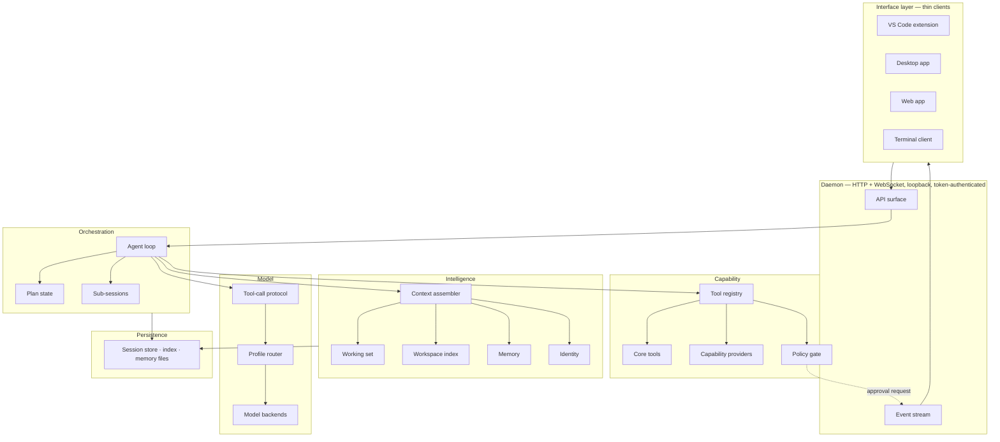
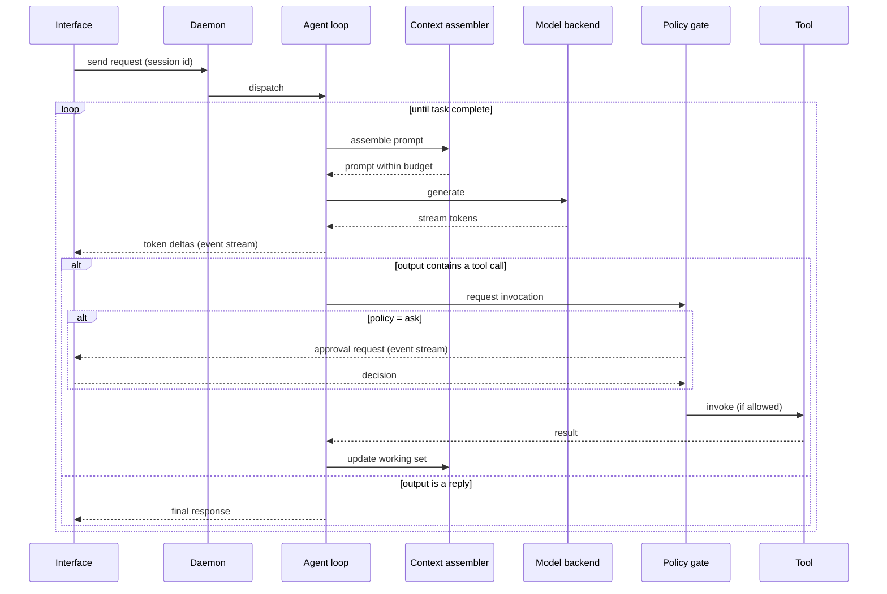

# Solara AI — Architecture

This document is the formal architecture of Solara AI. It is derived from the
decisions in [`decisions.md`](./decisions.md), which records *why* each choice was
made and what was rejected. Where the two disagree, the decision log wins and this
document is out of date.

---

## 1. What Solara is

Solara AI is a **coding AI first**. Software development is its purpose, not one
capability among many.

Solara is a **platform, not a chat wrapper**. The model is a replaceable component
inside it. Identity, coding behaviour, tools, context, memory, and security belong
to Solara and survive swapping the model underneath.

Three properties define the shape of everything below:

1. **One brain, many interfaces.** VS Code, desktop, and web are thin clients over
   a single core. No interface contains agent logic.
2. **Everything at the edges is replaceable.** Models, inference engines, tools,
   retrieval strategies, and interfaces are all implementations behind interfaces.
3. **Small models are a first-class target.** The architecture assumes constrained
   hardware and treats context and output tokens as scarce resources. Designs that
   only work with a large model are rejected.

---

## 2. Design principles

| Principle | Consequence |
|---|---|
| **The model is a component.** | Nothing model-specific leaks above the model layer. Tool calling, identity, and formatting are Solara's, not the model's. |
| **Context is the scarce resource.** | Every subsystem is judged partly by what it costs in tokens. Deduplication and eviction are designed, not emergent. |
| **Security is a choke point, not a practice.** | One gate every action passes through, below the API, so no interface and no nesting depth can bypass it. |
| **Structure before semantics.** | Exact, cheap, debuggable mechanisms (parsers, search, files) before probabilistic ones (embeddings, learned relevance). |
| **Visible over clever.** | Memory, plans, and permissions are inspectable and correctable by the user. Silent state that shapes behaviour is a defect. |
| **Seams before features.** | Boundaries for things not yet built (hosted accounts, credits, sandboxing, fine-tuned models) are defined now and stubbed. |

---

## 3. System overview



Dependencies point downward. The model layer knows nothing about sessions; the
capability layer knows nothing about models; interfaces know nothing about either.

---

## 4. The layers

### 4.1 Interface layer

VS Code extension, desktop app, web app, and a terminal client — all TypeScript
except the terminal client, all **thin**. They render state and collect input.
They contain no agent logic, no prompt construction, and no tool execution.

They connect to the daemon over its versioned API and render the activity stream.
Because the stream is the only source of truth about what Solara is doing, a new
interface is a rendering problem rather than a reimplementation.

*Local vs. hosted:* a browser cannot reach a local daemon over the internet. The
web app is therefore served **by the daemon itself** for local use. The hosted
deployment at `solara.rubby-studios.com` runs the same core server-side per
principal — the seam that D0 keeps open and does not yet implement.

### 4.2 Daemon

A long-running process that owns the core and the loaded model. Keeping the model
resident across requests is a primary reason this layer exists: reload costs are
punitive on the target hardware.

- **HTTP** for operations: session lifecycle, sending a request, interruption,
  approval responses, workspace and profile management.
- **WebSocket** for the activity stream.
- **Loopback binding and a per-session bearer token are mandatory.** The daemon
  loads a model and executes shell commands; without both, any local process or
  visited web page obtains arbitrary code execution. This is a property of the
  transport, not a hardening task for later.
- **Versioned from the first commit**, because three interfaces depend on it and
  will not upgrade together.
- **Interruption cancels mid-generation** and leaves the session resumable. At
  3–6 tok/s users stop tasks constantly; interruption that only lands between model
  calls is not usable.

### 4.3 Orchestration

**The agent loop** owns a task from request to completion. One loop, not a standing
hierarchy of agents.

**Plan state** is explicit, persistent, and revisable. The model rewrites it as it
learns, because a plan written before reading the code is usually wrong. It also
makes progress legible and tasks resumable.

**Phases** — explore, plan, edit, verify — guide behaviour and scope tool exposure.
They are soft: the loop moves between them as the work demands.

**Sub-sessions** are the primary defence against context exhaustion. The loop may
delegate a sub-task to a context-isolated child that runs fresh, returns a compact
result, and is evicted from the parent's context.

Three rules govern them:

- **Evicted from context, retained in the store.** Summaries are lossy; destroying
  the source means redoing the work when the summary proves insufficient.
- **Selective, never reflexive.** A sub-session re-pays identity, tool schemas, and
  briefing. At roughly 20–40 tok/s prompt processing on the current machine, a 4k
  briefing costs 100–200 seconds before its first output token. Delegation pays off
  only for work that **reads a lot and returns a little** — exploration and failure
  triage are the archetypes; producing a large diff is not.
- **Invisible is not unsupervised.** Approvals raised inside a sub-session escape to
  the real user, and permissions are inherited as a subset, never a superset.

### 4.4 Intelligence

**The context assembler** builds the prompt every turn from prioritised segments
under a token budget derived from the backend's declared context length:

| Priority | Segment |
|---|---|
| 1 | Identity |
| 2 | Tool schemas (scoped) |
| 3 | Plan state |
| 4 | Workspace memory (bounded excerpt) |
| 5 | Working set |
| 6 | Conversation history |
| 7 | Current request |

Eviction is **by priority, then recency** — never recency alone, or important early
facts are lost merely for being early.

**The working set** is where file content lives, and the only place it lives.
Conversation history references it rather than repeating it, so a file read three
times occupies context once. It makes "what can the model currently see" an
explicit, inspectable property rather than an accident of message ordering.

**The workspace index** is structural: tree-sitter parsing into symbols,
definitions, references and imports, plus fast literal and regex search. It is
tiered — no index for single files, in-memory for small projects, persistent and
incremental for large ones. Semantic embeddings sit behind a `Retriever` seam,
deliberately unbuilt: code lookup is overwhelmingly exact, and a second resident
model is expensive on a 16 GB machine.

**Memory** is three bounded, human-readable stores: a per-workspace memory file, a
user-global preferences file, and the durable session store. Solara writes memory
through the ordinary edit path, so a wrong fact is visible and correctable rather
than silently poisoning every future session.

**Identity** is a structured artifact — core identity, coding philosophy, hard
rules, output conventions, tool-use discipline — not a prompt string. See §6.

### 4.5 Capability

**Core tools**, always present and deliberately few: `read_file` (line-ranged),
`edit_file`, `write_file`, `list_directory`, `search`, `run_command`, `delegate`,
and plan revision. Small because every tool schema is both token cost and an
opportunity for a small model to choose wrong.

**Capability providers** register everything else — version control, test runners,
package managers, build systems, and later external MCP servers. Adding a
capability never means editing the agent. Providers **activate on detection**: a
workspace with no version control and no test runner is an ordinary case, not an
error.

**The policy gate** is the single point every tool invocation passes through, from
any interface at any nesting depth, resolving each call to **allow**, **deny**, or
**ask**. It evaluates workspace roots (with traversal and symlink escapes resolved
*before* the check), command risk classification, and the acting principal. No
attached interface, or an expired request, resolves to **deny**.

OS-level sandboxing plugs in behind this same gate as an additional enforcement
backend — required for hosted multi-tenancy, optional locally.

### 4.6 Model

**Model profiles** bundle weights, prompt template, sampling parameters, identity
rendering, and tool policy. A profile — not a prompt variant — is what a behaviour
mode selects. This is also how task-appropriate routing works: a small fast model
for classification, summarisation and mechanical edits; a larger one for planning
and reasoning.

**The tool-call protocol** is Solara's own, not the model's. Delimited blocks in the
output stream, parsed tolerantly with repair-and-retry, and additionally
grammar-constrained where the backend supports it. Malformed tool calls are an
expected event with a defined recovery path, not an error state.

**Model backends** implement one interface. The first manages a `llama-server`
child process and uses **both** its OpenAI-compatible and **raw completion**
endpoints. Retaining raw access is what preserves prompt-template control, GBNF
grammar constraints, and explicit sampling and cache control. Remote backends
implement the same interface; local is the default, remote is not a special case.

**Capabilities are declared, not assumed.** Each backend exposes context length,
maximum output, grammar support, native tool-calling, streaming, cache reuse, and
token counting. Solara selects strategies from that descriptor, and every capability
has a working fallback.

### 4.7 Persistence

Sessions and sub-sessions, the structural index, and memory files. Workspace memory
lives inside the workspace when writable, so it is diffable and — where version
control exists — committable at the user's discretion. Nothing in persistence
assumes version control.

---

## 5. Key flows

### 5.1 A request, end to end



### 5.2 Delegation to a sub-session

The loop decides a sub-task reads a lot and returns a little. It writes a briefing,
opens a sub-session with a subset of its permissions, and waits. The child runs its
own loop with a fresh context, using the same tools through the same gate. It
returns a compact result, which enters the parent's working set. Everything it read
does not. The transcript is persisted and addressable; it is gone from the prompt,
not from the system.

### 5.3 An edit

The model emits an exact search/replace block. Solara applies it only on exact
match, then parse-checks the result with the tree-sitter grammar already loaded for
indexing; an edit that breaks syntax is rejected and reported rather than written.
A failed match re-reads the region and retries once against fresh content; repeated
failure escalates to rewriting the enclosing function or block — never the whole
file, because full-file output at 3–6 tok/s costs tens of minutes.

---

## 6. How identity is actually enforced

Identity is enforced at three levels, which is what makes it structural rather than
aspirational:

1. **Composition** — the identity artifact is rendered into the prompt per model
   profile. Profiles may adapt the rendering to a model's template; the source of
   truth remains one artifact.
2. **Runtime** — the tool protocol and policy gate constrain what Solara can *do*,
   independent of what any model says. Behaviour that matters is enforced by the
   system, not requested of the model.
3. **Evaluation** — an eval suite asserts Solara behaves as Solara on any backend,
   so changing models is a measurable event rather than a silent drift.

**Behaviour modes are model profiles, not exemptions.** A more permissive mode
selects different weights and a relaxed content rule set. It does not relax the
policy gate, the workspace jail, or approval requirements — those are properties of
Solara, and no profile can switch them off.

Longer term, fine-tuned Solara-specific models are where identity ultimately
belongs. The eval suite is already the validation harness for that work, and real
sessions accumulate the data. That path is a continuation of this architecture, not
a replacement for it.

---

## 7. Module layout

```
solara/
  core/            shared types, configuration, errors
  identity/        identity artifact and composition
  model/           ModelBackend interface, profiles, router
    backends/      llama.cpp (managed process), OpenAI-compatible
  protocol/        tool-call syntax, tolerant parser, grammar generation
  agent/           loop, phases, plan state, sub-sessions
  context/         assembler, working set, token budgeting
  workspace/       roots, identity, tree-sitter index, search
  memory/          workspace memory, user memory
  tools/           registry, core tools, scoped exposure
    providers/     version control, tests, packages, build, MCP (later)
  policy/          policy gate, risk classification, approvals
  session/         session and sub-session store
  events/          typed event definitions and emission
  daemon/          HTTP and WebSocket API, authentication
  accounting/      usage metering — local no-op, hosted seam
  eval/            identity and capability evaluation harness

clients/
  terminal/        first client, proves the API
  vscode/          VS Code extension
  desktop/         desktop application
  web/             web application
```

---

## 8. Extension points

The modularity contract. Each is an interface with at least one implementation and
a defined path to more.

| Extension point | Add by |
|---|---|
| **Inference engine** | Implementing `ModelBackend` and declaring capabilities. |
| **Model** | Adding a model profile. No code change. |
| **Behaviour mode** | Adding a model profile with its own rule set. |
| **Tool** | Registering with the tool registry; the policy gate applies automatically. |
| **Capability provider** | Implementing detection plus tool registration. |
| **Retrieval strategy** | Implementing `Retriever` — where embeddings would land. |
| **Interface** | Speaking the versioned API and rendering the event stream. |
| **Security enforcement** | Adding an enforcement backend behind the policy gate. |
| **Observability / accounting** | Subscribing to the typed event stream. |

---

## 9. Deliberately not built yet

Named so they are recognised as deferred decisions rather than oversights. Each has
a defined seam.

| Deferred | Seam that keeps it reachable |
|---|---|
| Accounts and multi-tenancy | The principal on every session; the identity boundary. |
| Credits and metering | The accounting module, subscribed to the event stream. |
| OS-level sandboxing | An enforcement backend behind the policy gate. |
| Semantic embeddings | The `Retriever` interface. |
| Fine-tuned Solara models | Model profiles plus the eval harness. |
| MCP integration | The capability provider interface. |
| Internal message bus | The typed event stream it would grow from. |
| Inline completion | A distinct low-latency path; deliberately not the agent loop. |

---

## 10. Build order

The first milestone is a **vertical slice**, not a layer-by-layer build: terminal
client → daemon → session → agent loop → tool protocol → policy gate → core tools →
llama.cpp backend, running a real task against a real workspace on the current
hardware. Concretely: read a file, make one search/replace edit, verify it parses,
report back — starting with a 1.5B or 3B model, because iteration speed matters more
than capability while the plumbing is being proven.

Every risky assumption in this architecture lives at a seam: whether a small model
can drive the tool protocol, whether edits apply cleanly, whether context assembly
stays inside budget, whether the loop is bearable at local speeds. A vertical slice
tests all of them in days. A horizontal build tests none of them for months.

| Stage | Adds |
|---|---|
| 1 | The vertical slice above. |
| 2 | The full core toolset, plan state, phases, verification tiers 1–2. |
| 3 | Workspace index, scoped tool exposure, capability providers. |
| 4 | Sub-sessions and delegation. |
| 5 | Memory, identity eval harness. |
| 6 | VS Code extension; desktop and web clients. |
| 7 | Hosted seams: principals, accounting, sandboxing. |

---

*Derived from [`decisions.md`](./decisions.md) — D0 through D20, constraints C1–C8,
and product constraints P1–P5.*
