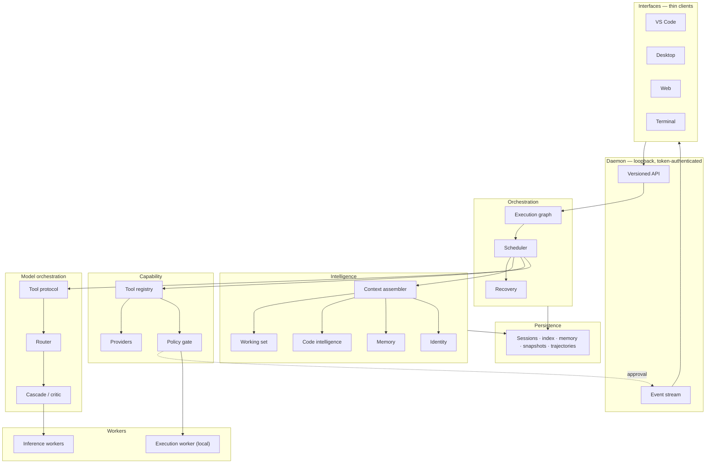
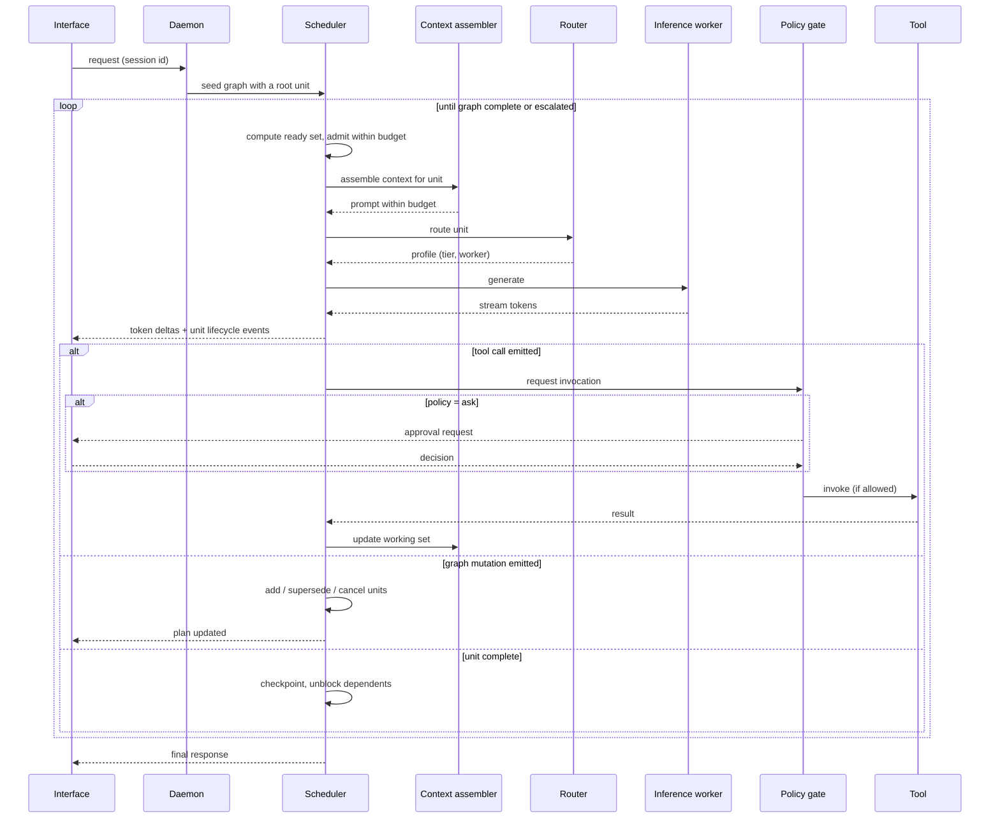

# Solara AI — Architecture

The formal architecture of Solara AI, derived from the decisions in
[`decisions.md`](./decisions.md), which records *why* each choice was made and what
was rejected. Where the two disagree, the decision log wins and this document is out
of date.

**Deep dives.** This document is the map. The detail lives in:

| Document | Covers |
|---|---|
| [`execution-graph.md`](./execution-graph.md) | Work units, scheduler, concurrency, resource model, checkpoints |
| [`model-orchestration.md`](./model-orchestration.md) | Speculative decoding, cascade, critic, self-consistency, routing, profiles |
| [`code-intelligence.md`](./code-intelligence.md) | Symbol, dependency and call graphs; change-impact analysis; architecture maps |
| [`resilience.md`](./resilience.md) | Stuck detection, recovery, shadow snapshots, budgets |
| [`learning.md`](./learning.md) | Trajectories, implicit labels, eval ratchet, distillation |
| [`distribution.md`](./distribution.md) | Worker pools, placement, why inference distributes and execution does not |

---

## 1. What Solara is

Solara AI is a **coding AI first**. Software development is its purpose, not one
capability among many.

Solara is a **platform, not a chat wrapper**. The model is a replaceable component
inside it. Identity, coding behaviour, tools, context, memory, and security belong to
Solara and survive swapping the model underneath.

Four properties define the shape of everything below:

1. **One brain, many interfaces.** VS Code, desktop, and web are thin clients over a
   single core. No interface contains agent logic.
2. **Everything at the edges is replaceable.** Models, inference engines, tools,
   retrieval strategies, workers, and interfaces are implementations behind
   interfaces.
3. **Small models are a first-class target.** Context and output tokens are treated
   as scarce. Designs that only work with a large model are rejected.
4. **Capability in the architecture, modest defaults in configuration.** Hardware
   determines settings, never structure. Every mechanism degrades cleanly when its
   budget is set to one.

The fourth property is a correction. The first version of this architecture let the
current laptop constrain the design itself, which contradicted the requirement that
Solara not be tied to one machine. Decisions D21–D26 fixed that.

---

## 2. Design principles

| Principle | Consequence |
|---|---|
| **The model is a component.** | Nothing model-specific leaks above the model layer. Tool calling, identity and formatting are Solara's. |
| **Context is the scarce resource.** | Every subsystem is judged partly in tokens. Deduplication and eviction are designed, not emergent. |
| **Security is a choke point, not a practice.** | One gate every action passes through, below the API, above every worker. |
| **Structure before semantics.** | Parsers, graphs and search before embeddings and learned relevance. |
| **Honest uncertainty.** | Where analysis is approximate — heuristic call edges, stale index regions — the agent is told, not misled. |
| **Visible over clever.** | Memory, plans, routing decisions and permissions are inspectable and correctable. |
| **Degrade, don't fail.** | Budget pressure lowers tiers; worker loss falls back to local; recovery precedes failure. |
| **Seams before features.** | Boundaries for unbuilt things are defined now and stubbed. |

---

## 3. System overview



Dependencies point downward. The model layer knows nothing about sessions; the
capability layer knows nothing about models; interfaces know nothing about either.
The policy gate sits above execution and **never moves to a worker**.

---

## 4. The layers

### 4.1 Interfaces

VS Code extension, desktop app, web app, terminal client. All **thin**: they render
state and collect input, and contain no agent logic, prompt construction, or tool
execution. They speak the versioned API and render the activity stream, so a new
interface is a rendering problem rather than a reimplementation.

A browser cannot reach a local daemon over the internet, so the local web app is
served **by the daemon itself**. The hosted deployment runs the same core
server-side per principal — the D0 seam, defined and unimplemented.

### 4.2 Daemon

A long-running process owning the core and the loaded models. Model residency across
requests is a primary reason it exists: reload costs are punitive on the target
hardware.

HTTP for operations, WebSocket for the activity stream. **Loopback binding and a
per-session bearer token are mandatory** — the daemon loads models and executes shell
commands, so without both, any local process or visited web page obtains arbitrary
code execution. Versioned from the first commit. Interruption cancels
mid-generation and leaves the session resumable, because at 3–6 tok/s users stop
tasks constantly.

### 4.3 Orchestration

**A task is a graph, not a loop.** Work units declare kind, dependencies, context
policy, resource class, permissions, and an explicit result contract. A scheduler
runs whatever is runnable within budget. **A loop is a graph of width one**, so
concurrency 1 reproduces sequential behaviour exactly.

**The plan is the graph.** Revising the plan means mutating the graph — adding,
superseding, cancelling, re-opening units. There is no separate plan artifact that
can drift from what is executing.

**Concurrency is derived from hardware, not fixed.** Under llama.cpp, concurrent
requests share model weights through continuous batching, so a slot costs KV cache
rather than a second model — roughly 56 KB/token for Qwen2.5-Coder-7B, about 450 MB
at 8k context. On GPU that makes concurrency cheap. **On CPU it does not**: parallel
slots contend for the same cores, so throughput stays flat while latency doubles.
The scheduler models this and defaults to concurrency 1 on CPU hosts.

**Isolated units are the context defence.** A unit may run with a fresh context,
return a compact result under its declared contract, and be evicted from the parent's
context while persisting in the store. It pays off only for work that **reads a lot
and returns a little** — exploration and failure triage — because each isolated unit
re-pays identity, tool schemas and briefing, which at ~20–40 tok/s prompt processing
is 100–200 seconds for a 4k briefing.

**Writes serialise.** Reads parallelise freely; two units editing one file is a
correctness hazard, so write sets are declared and locked.

→ [`execution-graph.md`](./execution-graph.md)

### 4.4 Intelligence

**The context assembler** builds each unit's prompt from prioritised segments under a
budget derived from the backend's declared context length:

| Priority | Segment |
|---|---|
| 1 | Identity |
| 2 | Tool schemas (scoped) |
| 3 | Graph state relevant to this unit |
| 4 | Workspace memory (bounded excerpt) |
| 5 | Working set |
| 6 | Conversation history |
| 7 | Current request |

Eviction is **by priority, then recency** — never recency alone, or important early
facts are lost merely for being early.

**The working set** is where file content lives, and the only place it lives. History
references it rather than repeating it, so a file read three times occupies context
once. It makes "what can the model currently see" explicit and inspectable.

**Code intelligence** is layered and structural:

```
5  Architecture map        modules, layers, entry points, hot spots
4  Change-impact analysis  what breaks if this changes
3  Call graph              who calls whom, with confidence labels
2  Dependency graph        what imports what
1  Symbol index            definitions, references, exports
0  Files and text          content-addressed, searchable
```

Change-impact analysis is the payoff: it makes verification's targeted-test tier
genuinely targeted, drives critic-pass policy, and is the real content of
"understanding a large codebase." Call-graph edges are labelled `certain`,
`probable`, `heuristic` or `unresolved`, because precise call graphs are undecidable
for dynamic languages and hiding that produces confident wrong answers. History
intelligence — churn, co-change coupling — activates only when version control
exists.

**Memory** is three bounded, human-readable stores: a per-workspace memory file, user
preferences, and the session store. Written through the ordinary edit path, so a
wrong fact is visible and correctable rather than silently poisoning future sessions.

**Identity** is a structured artifact, not a prompt string. See §6.

→ [`code-intelligence.md`](./code-intelligence.md)

### 4.5 Capability

**Core tools**, always present and deliberately few: `read_file` (line-ranged),
`edit_file`, `write_file`, `list_directory`, `search`, `run_command`, `delegate`, and
graph mutation. Small because every schema is both token cost and an opportunity for
a small model to choose wrong.

**Capability providers** register everything else — version control, test runners,
package managers, build systems, later MCP servers. They **activate on detection**: a
workspace with no version control and no test runner is an ordinary case.

**The policy gate** is the single point every tool invocation passes through, from any
interface at any graph depth, resolving **allow / deny / ask**. It evaluates workspace
roots (traversal and symlink escapes resolved *before* the check), command risk
classification, and the acting principal. No attached interface, or an expired
request, resolves to **deny**. Units inherit a subset of parent permissions, never a
superset.

OS-level sandboxing plugs in behind the same gate as an additional enforcement
backend.

### 4.6 Model orchestration

**Profiles** bundle weights, template, sampling, identity rendering, tool policy,
content rules and tier. A behaviour mode selects a profile, not a prompt variant.

**Four orchestration mechanisms**, distinct and composable:

| Mechanism | Buys | Costs |
|---|---|---|
| **Speculative decoding** | ~2–3× throughput on GPU, less on CPU | A draft model resident (~350–400 MB at 0.5B Q4) |
| **Cascade** | Fewer expensive calls | A verification step; latency on escalation |
| **Critic pass** | Fewer bad edits reaching disk | Roughly doubles the edit path |
| **Self-consistency** | Better answers from cheap models | N× tokens; needs parallelism |

Cascade pays when the cheap tier's success rate exceeds roughly
`(c_cheap + c_verify) / c_expensive` — so it applies to mechanical edits,
classification and triage, and not to novel design where verification is as hard as
the task.

**The router** maps *(unit kind, complexity, remaining budget, hardware, mode,
escalation history)* to a profile. Every decision is emitted with its reason; users
can pin a profile; mode selection is absolute and the router only chooses tiers
within it; budget pressure lowers tiers **before** truncating context, because
degrading the model is more recoverable than degrading its information.

**The tool-call protocol** is Solara's own — delimited blocks parsed tolerantly with
repair-and-retry, additionally grammar-constrained where the backend declares
support. Malformed calls are an expected event with a defined recovery path.

→ [`model-orchestration.md`](./model-orchestration.md)

### 4.7 Workers

Compute is a pool of typed workers, and the asymmetry between them is the whole
design:

- **Inference workers distribute freely** — local child process, remote LAN machine,
  bare inference server, or cloud endpoint. They exchange tokens, not state.
- **Execution workers do not.** `pytest` runs against files; a tool call is
  meaningless without its workspace. Remote execution requires a synchronised
  workspace, which is the hosted-deployment problem and is not solved here.

Locality is a hard scheduling constraint, never a preference. Short units prefer
local workers because a network round-trip can exceed a tier-1 call. **The system
remains fully functional with zero remote workers** — distribution is an accelerator,
never a dependency. **The policy gate never moves to a worker**: a misbehaving
inference worker can produce bad output, but it cannot authorise a command.

The near-term payoff is concrete: the laptop holds the workspace, runs all tools and
enforces policy; a desktop GPU machine serves inference.

→ [`distribution.md`](./distribution.md)

### 4.8 Resilience

Recovery is a subsystem, not scattered error handling, because burning an entire
budget repeating one mistake is the *characteristic* failure of small models on long
tasks.

**Stuck signals**: repeated near-identical tool calls, no file-state change across
units, identical verification failures, repeated edit-match failures, oscillating
content hashes, budget consumed without graph progress, plan thrash.

**Escalating responses**: **reflect** (a cheap tool-less unit that states what was
tried and why it failed — often sufficient, since stuckness is usually an attention
problem), **backtrack** to a checkpoint, **switch strategy**, **escalate to the user**
with a real account, **abort to a clean workspace**.

**Shadow snapshots** make backtracking possible without version control: copy-on-write
copies of files Solara modified, keyed by checkpoint, stored outside the workspace.
Where a VCS exists it is a safety net, never the mechanism — Solara does not create
commits, stashes or branches unasked.

**Budgets degrade before they fail.** At 70% the router lowers tiers; at 90%
speculative work stops; at 100% the task escalates with state intact — never silently
killed, never silently continued.

→ [`resilience.md`](./resilience.md)

### 4.9 Learning

Sessions produce **trajectories**: assembled context (recorded, not reconstructed),
raw model output (kept alongside the parse), tool calls, edits, verification
outcomes, interventions, cost and environment.

Outcomes are labelled from **implicit signals**, since nobody labels manually. The
strong ones — verification passed, edit survived, user reverted immediately, user
rephrased the same request — produce training data. Weaker ones inform routing.
Unknown outcomes are discarded rather than guessed.

**The eval suite is a ratchet**: frozen, checkable cases covering protocol
conformance, edit application, task completion, context discipline, identity, safety,
efficiency and resilience. Every real failure becomes a case. Cases are never edited
to make them pass.

**Distillation** is the realistic path to Solara-specific models: a strong remote
backend executes real tasks through the full stack, verification filters the results,
and survivors become supervised examples whose *input is Solara's assembled context*
and whose *output is Solara's tool protocol*. That is what makes the result
Solara-specific rather than generically good at code — and a LoRA on modest hardware
can do it.

Trajectories contain the user's source. **Local by default, opt-in to collect,
redacted on export, individually deletable.**

→ [`learning.md`](./learning.md)

### 4.10 Persistence

Sessions and graphs, the layered index, memory files, shadow snapshots, and
trajectories. SQLite for indexes and structured state; plain files for memory, so it
stays diffable. Workspace memory lives inside the workspace when writable. Nothing
assumes version control.

---

## 5. Key flows

### 5.1 A task, end to end



### 5.2 Delegation

The scheduler judges a sub-task read-heavy and return-light. It writes a briefing,
creates an isolated unit with a subset of the parent's permissions and a declared
result contract, and schedules it. The child runs with a fresh context, using the
same tools through the same gate. Its compact result enters the parent's working set;
everything it read does not. Its transcript persists and stays addressable.

### 5.3 An edit

The model emits an exact search/replace block. Solara applies it only on exact match,
then parse-checks the result with the tree-sitter grammar already loaded for
indexing; a syntax-breaking edit is rejected, not written. Change-impact analysis
scores the blast radius, which decides whether a critic pass runs and which tests
verification should target. A failed match re-reads the region and retries once;
repeated failure escalates to rewriting the enclosing function — never the whole
file, because full-file output at 3–6 tok/s costs tens of minutes.

### 5.4 Getting stuck

Signals accumulate. Recovery runs a tool-less reflect unit; if that yields no new
approach, it restores graph and file state to the last checkpoint *before the
deciding branch*, marks the failed subtree superseded, and switches strategy —
usually a tier escalation or a fresh diagnosis. Bounded attempts, then escalation to
the user with a real account of what was tried.

---

## 6. How identity is enforced

Three levels, which is what makes it structural rather than aspirational:

1. **Composition** — the identity artifact renders into the prompt per profile.
   Profiles adapt the rendering; the source of truth is one artifact.
2. **Runtime** — the tool protocol and policy gate constrain what Solara can *do*,
   independent of what any model says.
3. **Evaluation** — the eval suite asserts Solara behaves as Solara on any backend, so
   changing models is measurable rather than silent.

**Behaviour modes are profiles, not exemptions.** A permissive mode selects different
weights and content rules. It does not relax the policy gate, the workspace jail, or
approval requirements — those are properties of Solara, and no profile can switch them
off.

Fine-tuned Solara-specific models are where identity ultimately belongs; §4.9 is the
path there, and the eval suite is already its validation harness.

---

## 7. Module layout

```
solara/
  core/            shared types, configuration, errors
  identity/        identity artifact and composition
  model/           ModelBackend interface, profiles
    backends/      llama.cpp (managed process), OpenAI-compatible
    orchestration/ router, cascade, critic, self-consistency
  protocol/        tool-call syntax, tolerant parser, grammar generation
  graph/           work units, mutation, checkpoints
  scheduler/       admission, ranking, placement, write locks
  recovery/        stuck signals, strategies, shadow snapshots, budgets
  context/         assembler, working set, token budgeting
  workspace/       roots, identity, tiering
    index/         symbols, dependency graph, call graph, impact, arch map
  memory/          workspace memory, user memory
  tools/           registry, core tools, scoped exposure
    providers/     version control, tests, packages, build, MCP (later)
  policy/          policy gate, risk classification, approvals
  session/         session and unit store
  workers/         registry, health, transport
  events/          typed event definitions and emission
  daemon/          HTTP and WebSocket API, authentication
  accounting/      usage metering — local no-op, hosted seam
  learning/        trajectories, labelling, export, distillation pipeline
  eval/            frozen cases, runners, reporting

clients/
  terminal/        first client, proves the API
  vscode/          VS Code extension
  desktop/         desktop application
  web/             web application
```

---

## 8. Extension points

The modularity contract. Each is an interface with at least one implementation and a
defined path to more.

| Extension point | Add by |
|---|---|
| **Inference engine** | Implementing `ModelBackend` and declaring capabilities |
| **Model** | Adding a profile. No code change |
| **Behaviour mode** | Adding a profile with its own content rules |
| **Draft model** | Declaring it on a profile; the backend handles the rest |
| **Tool** | Registering with the registry; the policy gate applies automatically |
| **Capability provider** | Implementing detection plus tool registration |
| **Language support** | Adding a tree-sitter grammar plus an import resolver |
| **Retrieval strategy** | Implementing `Retriever` — where embeddings would land |
| **Work unit kind** | Registering a kind with its context policy and routing hint |
| **Recovery strategy** | Registering a signal plus a response |
| **Worker** | Registering an endpoint with declared capabilities and locality |
| **Interface** | Speaking the versioned API and rendering the event stream |
| **Security enforcement** | Adding an enforcement backend behind the policy gate |
| **Observability / accounting** | Subscribing to the typed event stream |

---

## 9. Deliberately not built yet

Named so they are recognised as deferred decisions rather than oversights. Each has a
seam.

| Deferred | Seam |
|---|---|
| Accounts and multi-tenancy | The principal on every session |
| Credits and metering | The accounting module, on the event stream |
| OS-level sandboxing | An enforcement backend behind the policy gate |
| Workspace synchronisation | Required before remote execution workers are meaningful |
| Semantic embeddings | The `Retriever` interface |
| Fine-tuned Solara models | Profiles plus the eval harness plus the distillation pipeline |
| MCP integration | The capability provider interface |
| Internal message bus | The typed event stream it would grow from |
| Inline completion | A distinct low-latency path, deliberately not the agent graph |

---

## 10. Build order

The first milestone is a **vertical slice**, not a layer-by-layer build: terminal
client → daemon → session → graph at width 1 → tool protocol → policy gate → core
tools → llama.cpp backend, running a real task against a real workspace on current
hardware. Concretely: read a file, make one search/replace edit, verify it parses,
report back — starting with a 1.5B or 3B model, because iteration speed matters more
than capability while the plumbing is being proven.

Every risky assumption lives at a seam: whether a small model can drive the protocol,
whether edits apply cleanly, whether context assembly stays in budget, whether the
loop is bearable at local speeds. A vertical slice tests all of them in days; a
horizontal build tests none for months.

| Stage | Adds | Unlocked by |
|---|---|---|
| 1 | Vertical slice: graph at width 1, core tools, policy gate, one backend | — |
| 2 | Full core toolset, graph mutation, verification tiers 1–2, budgets | Stage 1 |
| 3 | Symbol index, scoped tool exposure, capability providers | Stage 2 |
| 4 | Isolated units, result contracts, checkpoints, shadow snapshots | Stages 2–3 |
| 5 | Stuck detection and recovery strategies | Stage 4 |
| 6 | Dependency and call graphs, change-impact analysis, targeted tests | Stage 3 |
| 7 | Router, cascade, critic; speculative decoding when GPU hardware arrives | Stages 2–6 |
| 8 | Trajectory capture and the eval suite | Stage 2 onward — earlier is better |
| 9 | Memory, architecture maps, identity eval | Stages 5–6 |
| 10 | Concurrency > 1, self-consistency, speculative branches | GPU hardware |
| 11 | VS Code extension; desktop and web clients | Stage 2 onward |
| 12 | Inference workers on a second machine | Stage 7 |
| 13 | Distillation pipeline and the first Solara-tuned model | Stage 8 plus real usage |
| 14 | Hosted seams: principals, accounting, sandboxing, workspace sync | Everything above |

Stage 8 is placed early deliberately. Trajectory capture and the eval suite are
cheap to build and compound in value the longer they run; adding them late discards
every measurement that could have been taken in the meantime.

---

*Derived from [`decisions.md`](./decisions.md) — constraints C1–C8, product
constraints P1–P5, decisions D0–D26.*
